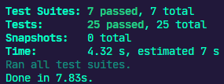

# Desafio 5 do Ignite Trilha NodeJS


<h3 align="center">
  Desafio 05: Documentando com Swagger
</h3>

<p align="center">
  
  <a href="https://app.rocketseat.com.br/me/matheus-marins">
    
  </a>
 <a href="https://github.com/Mar0la/ignite-documentando-com-swagger/stargazers">
    
  </a>
</p>

---

# :rocket: Sobre o desafio

Utilizando uma aplicação já funcional como base, realizei a documentação das rotas com o Swagger.

 ### **Para saber tudo sobre o desafio acesse [NotionDesafio](https://www.notion.so/Desafio-02-Documentando-com-Swagger-8ce869ea608743e292851bd951f3239f).**
 
---
### :keyboard: Instalação e Execução do Projeto

- Clone este repositório

```
> git clone https://github.com/Mar0la/ignite-documentando-com-swagger
```

- Navegue até o diretório principal do projeto

```
> cd documentando-com-swagger
```

- Instale as dependências com o Yarn

```
yarn
```

- Rode a suite de testes

```
yarn test
```

- Execute o projeto

```
yarn dev
```
- Para ver a documentação cole o url abaixo no navegador

```
http://localhost:3333/api-docs/
```
---
### **Resolução do Desafio**
  [Meu documentação.](https://github.com/Mar0la/ignite-documentando-com-Swagger/blob/main/src/swagger.json)


### **Retorno que devemos ter ao digitar  <code>yarn test</code>** no terminal
  

---
## FeedBack do Desafio
  - Não tenho muito a falar sobre esse desafio, apenas que com a documentação do **swagger** do lado, fazer uma documentação de API não se torna algo  complicado, somente é uma coisa não tão atrativa de ser feita.
---


